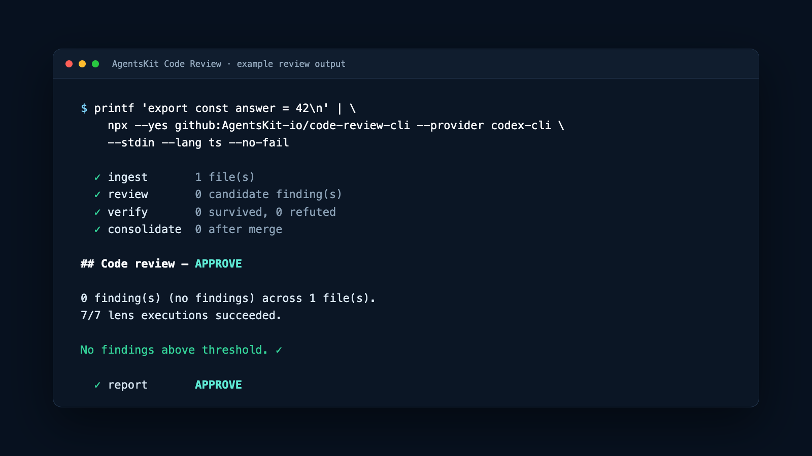
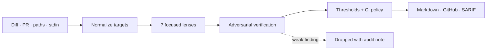

<p align="center">
  
</p>

# AgentsKit Code Review

Profile: <code>top-level-repository</code>

**Deep, low-noise AI code review with the model you already use.**

It is intended for developers and teams who want focused review feedback without changing their model subscription, and without adopting a separate chat product surface.

[](https://github.com/AgentsKit-io/code-review-cli/actions/workflows/ci.yml)
[](https://www.bestpractices.dev/projects/13866)
[](LICENSE)
[](package.json)

**Tags:** `agentskit` · `ai-code-review` · `github-action` · `typescript` · `sarif` · `codex` · `claude` · `ollama`

**Topics:** `ai-agents` · `code-review` · `developer-experience`

**Ecosystem:** [AgentsKit](https://www.agentskit.io/docs) · [Registry](https://registry.agentskit.io/docs) · [Chat](https://chat.agentskit.io/docs) · [Playbook](https://playbook.agentskit.io/docs) · [Doc Bridge](https://agentskit-io.github.io/doc-bridge/) · **Code Review** · [AKOS](https://akos.agentskit.io/docs)

Run code review locally or on every pull request. Bring Claude, Codex, OpenAI, Gemini, Ollama, OpenRouter, or another supported AgentsKit adapter. Seven focused review lenses propose potential problems; adversarial verification filters weak findings before they reach your team.

## Verified proof

- Offline CLI discovery works without credentials (`--help`, `--list-providers`) — covered by `test/cli-smoke.test.mjs`.
- A clean local Codex CLI fixture completes an offline stdin review — covered by the same smoke suite.
- Documentation, Action contract, and Doc Bridge gates run through `npm run check`.
- Machine-readable public map: [`llms.txt`](llms.txt) and [`docs/for-agents/code-review-cli.md`](docs/for-agents/code-review-cli.md).

## Why this exists

Most AI reviewers are easy to start and hard to trust: they produce long lists of stylistic opinions, repeat the same concern, and bury the issue that can actually break production.

AgentsKit Code Review is built around a different contract:

- **Bring your own model.** Use an existing CLI subscription, an API provider, a local model, or your own gateway.
- **Low noise by design.** Findings are challenged by independent verification votes before they survive.
- **Local first, CI ready.** Review a diff before pushing, inspect complete paths, read stdin, or comment directly on a GitHub PR.
- **Control cost and policy.** Set file budgets, concurrency, thresholds, project conventions, and blocking severity.
- **See the cost before execution.** Use `--plan --json` to inspect files, lenses, retries, concurrency, deadline, and estimated provider calls without a model request. Plans label estimates as `bounded` when `thresholds.maxPerFile` is set; otherwise they are `best-effort` because model output volume is inherently variable.

## Run your first review

Open a terminal inside any Git repository and choose a provider you already use. You do not need to clone or install AgentsKit Code Review:

<!-- readme-example:first-review -->
```sh
# Codex CLI — uses your existing login on a trusted local machine
npx --yes github:AgentsKit-io/code-review-cli --provider codex-cli --mode trusted-local

# Claude CLI — uses your existing login
npx --yes github:AgentsKit-io/code-review-cli --provider claude-cli

# OpenAI API
OPENAI_API_KEY=... npx --yes github:AgentsKit-io/code-review-cli \
  --provider openai --model gpt-4o
```

The CLI reviews the current repository's diff against `origin/main` and prints the report in your terminal. Choose another base with `--base main`.

For the Grok Build ACP worker, use `XAI_API_KEY` (or `--api-key`) in the default isolated mode. To reuse `grok login`, opt in explicitly with `--mode trusted-local`.

Local `codex-cli` subprocesses have a 300-second deadline per model call; `claude-cli` and the other local workers use 120 seconds. Every run also has a global deadline (10 minutes for full, 2 minutes for `fast`) and a bounded Codex smoke check before fan-out. Set `--deadline-ms` for a smaller explicit budget; timed-out calls fail explicitly and cannot turn an unreviewed file into an approval.

Terminal provider authentication failures stop the remaining lenses immediately; the review still exits incomplete and never converts a credential failure into approval.

The default `isolated` mode does not inherit an interactive CLI login. Use `--mode trusted-local` only on a machine or runner you trust with the provider's local session and environment.

`grok-cli` is stable and uses Grok Build's ACP transport (`grok agent stdio`) by default. In the default isolated mode, pass `XAI_API_KEY`/`--api-key`; the key is injected into the isolated worker environment, never into command arguments. Existing `grok login` state is available only with explicit local-only `--mode trusted-local`. Isolated workers grant no filesystem write, terminal, MCP, plugin, or subagent capability and use a temporary working directory. `--transport headless` is available for explicit non-interactive runs, while `--transport auto` is local-only and reports an ACP fallback before trying headless.

`opencode-cli` is stable and uses OpenCode's ACP transport (`opencode acp`) by default. In the default isolated mode, pass `OPENCODE_API_KEY`/`--api-key`; the selected key is injected into the isolated worker environment, never into command arguments. Existing OpenCode login/configuration state is available only with explicit local-only `--mode trusted-local`. OpenCode is not installed automatically. `--transport headless` is available for explicit non-interactive runs, while `--transport auto` is local-only and reports an ACP fallback before trying headless.

Preflight refuses an over-budget run before the first provider call. For GitHub PR sources, the CLI automatically caps the reviewed files to the safe call budget when `--max-files` is omitted; the remaining files are marked `UNREVIEWED`, so the result stays incomplete and cannot approve the PR. Use `--max-files` to choose a smaller explicit scope. `--dry-run` and `--plan` print the cap and concrete reductions; `--json` makes the plan machine-readable. CLI providers default to concurrency `1`, while API providers retain concurrency `4`. Required-lens or source coverage failures always exit `2`, even with `--no-fail`.
Use `--profile fast` when latency and provider budget matter more than the optional lenses: correctness, security, and tests run in one structured batch with one verification vote and no retry. The result records provider calls, failures, skips, elapsed time, circuit state, and whether the deadline fired. Any incomplete evidence remains fail-closed.



The current command runs directly from GitHub. After the first npm release, the shorter form will be:

```sh
npx @agentskit/code-review --provider codex-cli
```

## Run through pre-commit

The repository publishes a [`pre-commit`](https://pre-commit.com/) hook for teams that already use that framework. It is manual by default because a full adversarial review is slower and more expensive than a formatter or linter.

Add this to `.pre-commit-config.yaml`:

```yaml
repos:
  - repo: https://github.com/AgentsKit-io/code-review-cli
    rev: main # pre-release; pin a release tag when one contains the hook
    hooks:
      - id: agentskit-review
        args: [--provider, codex-cli, --no-fail, --max-files, "20"]
```

Then run it when a change is ready for review:

```sh
pre-commit run --hook-stage manual agentskit-review
```

The hook reviews the repository diff against `origin/main`; it does not claim to review only staged files. Override `--base` when your integration branch differs. To run on every push, override the hook with `stages: [pre-push]` and install that hook type explicitly, but first choose cost, latency, provider, and blocking policies appropriate for the repository.

### Review locally with Ollama

Use Ollama when repository policy requires model inference to stay on a machine or self-hosted runner. Pull a tool-capable coding model that fits the available memory, start Ollama, and review a small branch diff first:

```sh
ollama pull qwen2.5-coder:7b

npx --yes github:AgentsKit-io/code-review-cli \
  --provider ollama \
  --model qwen2.5-coder:7b \
  --base main \
  --base-url http://localhost:11434 \
  --max-files 10 \
  --concurrency 1 \
  --no-fail
```

This reviews committed changes between `main` and `HEAD`; it is not a staged-files-only hook. The selected model must support Ollama tool calling because every review lens submits a structured result. Requests have a 30-second default deadline. `--no-fail` keeps findings advisory, but connection, source, and execution errors still exit nonzero. No provider key is required. Local inference reduces code disclosure, but logs, SARIF files, caches, optional gateways, and observability exporters still need their own access and retention policy.

See the [operations guide](docs/OPERATIONS.md#local-ollama-review) for model sizing, health checks, failure handling, and self-hosted CI guidance.

## Use the GitHub Action

Add `.github/workflows/code-review.yml` to any repository:

```yaml
name: Code Review
on:
  pull_request:
    types: [opened, synchronize, reopened]

permissions:
  contents: read
  pull-requests: write

jobs:
  review:
    runs-on: ubuntu-latest
    steps:
      - uses: AgentsKit-io/code-review-cli@v0.3.0
        with:
          provider: openai
          model: gpt-4o
          api-key: ${{ secrets.LLM_API_KEY }}
          # max-files: '17'
          # max-calls: '1000'
          # max-findings-per-file: '7'
          # profile: 'full' # or fast for a bounded required-lens batch
          # deadline-ms: '600000'
          # fail-on-block: 'true' # advisory by default
          # block: high
```

The Action fetches the PR diff and posts one batched inline review plus a summary. Its defaults review at most 17 files, 7 findings per file, and 1,000 provider calls. It is advisory by default. Advisory mode affects findings only: source, provider, or execution failures still fail the check, and any reviewable file with zero successful primary lenses prevents approval. Summaries report successful and failed lens counts so partial degradation stays visible. `codex-cli` requires a pre-authenticated `trusted-local` self-hosted runner; use an API provider with a secret on GitHub-hosted runners. Enable `fail-on-block` and branch protection when you are ready to use findings as a merge gate.

Building a conversational review experience? Use [AgentsKit Chat](https://chat.agentskit.io/docs) for the cross-framework application layer instead of embedding chat here. Looking for organization-wide orchestration, governance, and production controls? Continue with [AKOS](https://akos.agentskit.io/docs).

Pin the Action to an immutable release tag such as `@v0.3.0`; use a full commit SHA when your policy requires the strongest reproducibility.

## Choose how to run

| Mode | Provider examples | Credentials | Best for |
|---|---|---|---|
| Local CLI | `codex-cli`, `claude-cli`, `grok-cli`, `opencode-cli` | Existing CLI login | Local development or self-hosted runners |
| Hosted API | `openai`, `anthropic`, `gemini`, `mistral`, `groq` | Provider API key | Managed CI |
| Local model | `ollama` | Usually none | Privacy and predictable cost |
| Gateway | `openrouter` or a custom `--base-url` | Gateway-specific | Central routing and policy |

`grok` is the xAI API provider; `grok-cli` is the separate Grok Build CLI entry. `opencode-cli` is the OpenCode CLI entry. API providers are discovered from factories exported by [`@agentskit/adapters`](https://www.npmjs.com/package/@agentskit/adapters). Run `npx --yes github:AgentsKit-io/code-review-cli --list-providers` to see IDs, support levels, transports, and model requirements.

Credentials resolve in this order:

1. `--api-key`
2. `LLM_API_KEY`
3. `<PROVIDER>_API_KEY`, such as `OPENAI_API_KEY`

Secrets passed to the GitHub Action are forwarded through the environment, not included in command-line arguments.

## How review works



The review agent lives in `agents/code-review/` and is vendored from the [AgentsKit registry](https://github.com/AgentsKit-io/agentskit-registry/tree/main/registry/code-review). The CLI owns provider selection, input sources, policy, and reporting.

## Common commands

```sh
# Tune verification and severity
npx --yes github:AgentsKit-io/code-review-cli --provider codex-cli \
  --base main --votes 5 --min-severity high

# Review a GitHub PR and post the result
GITHUB_TOKEN=... OPENAI_API_KEY=... \
  npx --yes github:AgentsKit-io/code-review-cli --provider openai --model gpt-4o \
  --pr owner/repo#42 --post

# Review complete files or directories
npx --yes github:AgentsKit-io/code-review-cli --provider claude-cli \
  --paths src --max-files 30

# Review piped source and also write SARIF
echo 'const x = a.b' | npx --yes github:AgentsKit-io/code-review-cli \
  --provider ollama --model llama3 \
  --base-url http://localhost:11434 --stdin --lang ts --sarif out.sarif

# After fetching the PR base and installing reviewdog, reuse its annotation transport
REPORT_FILE="$(mktemp)"
trap 'rm -f "${REPORT_FILE}"' EXIT
npx --yes github:AgentsKit-io/code-review-cli#3dfd7427640148281454d52846d369e5ddf85b11 \
  --provider openai --model gpt-4o \
  --base "origin/${BASE_REF}" --sarif "${REPORT_FILE}" --no-fail &&
reviewdog -f=sarif -name=agentskit-review \
  -reporter=github-pr-review -filter-mode=added -fail-level=error \
  < "${REPORT_FILE}"
```

The reviewdog recipe needs no custom converter: Code Review emits SARIF 2.1.0 and reviewdog consumes SARIF natively. See the [complete GitHub Actions job](docs/OPERATIONS.md#route-findings-through-reviewdog) for pinned installation, base-branch checkout, permissions, severity mapping, and CI ownership of the failure threshold.

## CLI reference

### Providers

Run these commands from the repository you want to review:

| Provider | What you need | Model | Example |
|---|---|---|---|
| `codex-cli` | Codex CLI logged in | Optional | `npx --yes github:AgentsKit-io/code-review-cli --provider codex-cli` |
| `claude-cli` | Claude CLI logged in | Optional | `npx --yes github:AgentsKit-io/code-review-cli --provider claude-cli` |
| `grok-cli` | Grok Build CLI; stable ACP/headless | Optional | `... --provider grok-cli` |
| `opencode-cli` | OpenCode CLI; stable ACP/headless | Optional | `... --provider opencode-cli` |
| `openai` | `OPENAI_API_KEY` | Required | `... --provider openai --model gpt-4o` |
| `anthropic` | `ANTHROPIC_API_KEY` | Required | `... --provider anthropic --model <model>` |
| `gemini` | `GEMINI_API_KEY` | Required | `... --provider gemini --model <model>` |
| `ollama` | Ollama running locally | Required | `... --provider ollama --model llama3 --base-url http://localhost:11434` |
| `openrouter` | `OPENROUTER_API_KEY` | Required | `... --provider openrouter --model <model>` |
| Other adapters | `<PROVIDER>_API_KEY` when applicable | Usually required | `... --provider <name> --model <model>` |

In shortened examples, replace `...` with `npx --yes github:AgentsKit-io/code-review-cli`.

### Options

| Flag | Meaning |
|---|---|
| `--provider <name>` | Required provider: local CLI or `@agentskit/adapters` factory |
| `--model <id>` | Model id; required for API/local-server providers |
| `--api-key <key>` | Provider key; environment variables are preferred |
| `--base-url <url>` | Provider endpoint, local server, or gateway |
| `--transport <name>` | Provider transport: `acp`, `headless`, or local-only `auto` where supported |
| `--base <ref>` | Git diff base; default `origin/main` |
| `--pr owner/repo#N` | GitHub PR source; requires `GITHUB_TOKEN` |
| `--paths <p...>` | Complete files or directories |
| `--stdin [--lang ts]` | Source read from stdin |
| `--post` | Post a batched review when the source is a PR |
| `--sarif <file>` | Also write SARIF |
| `--votes <n>` | Adversarial verification votes; default `3` |
| `--profile <full\|fast>` | Full review or one bounded required-lens batch |
| `--min-severity <level>` | Minimum reported severity |
| `--min-confidence <n>` | Minimum reported confidence |
| `--max-files <n>` | Positive file budget; over-budget runs are refused before the provider |
| `--max-calls <n>` | Provider-call budget; absolute ceiling `1000` |
| `--max-findings-per-file <n>` | Maximum verified findings per file; bounds adversarial verification calls |
| `--concurrency <n>` | Parallel model calls; default `1` for CLI providers, `4` for API providers |
| `--deadline-ms <n>` | Global run deadline; defaults to `600000` (`120000` for `fast`) |
| `--health-check <auto\|off>` | Bounded provider smoke check before model fan-out |
| `--plan`, `--dry-run` | Print provider-free preflight; add `--json` for machine output |
| `--validate-patch` | Run `git apply --check` on suggested patches |
| `--block <severity>` | CI gate floor; default `blocker` |
| `--no-fail` | Keep findings advisory |
| `--conventions <path>` | Inject project conventions |
| `--allow-incomplete` | Local-only exception for a config that declares incomplete lens coverage |
| `--allow-unredacted` | Local-only exception; rejected in CI |
| `--api` | Back-compatible alias for `--provider anthropic` |
| `doctor --provider <name>` | Offline provider diagnostics; no model request |
| `doctor --live` | Explicit provider smoke-test mode |
| `doctor --json` | Stable machine-readable diagnostics |
| `--mode <mode>` | `isolated` (default) or explicit local-only `trusted-local` |
| `--help` | Full command help |

When no conventions path is supplied, the CLI looks for `CONVENTIONS.md`, `CONTRIBUTING.md`, `.cursorrules`, or `AGENTS.md`.

### Versioned configuration

The repository may contain one strict `.agentskit-review.json` file. It must use
`configVersion: 1`; unknown fields, secrets, unsupported values, and unsafe lens
policies fail before provider execution with exit `2`. Every built-in lens is
enabled by default, with `correctness`, `security`, and `tests` required. Flags
override file values. A required lens may only be disabled in an explicitly
declared `incompleteProfile`, which requires `--allow-incomplete` locally and is
never accepted in CI.

```json
{
  "configVersion": 1,
  "profile": "full",
  "lenses": {
    "performance": { "enabled": false, "required": false }
  },
  "votes": 3,
  "budget": { "maxFiles": 20, "maxCalls": 200, "concurrency": 1, "deadlineMs": 600000 },
  "worker": { "timeoutMs": 120000, "maxOutputBytes": 20971520 },
  "thresholds": { "minSeverity": "med", "minConfidence": 0.7 },
  "context": { "mode": "prompt", "patterns": ["src/**"] }
}
```

Provider, model, transport, context trust, redaction, and permissions are
trusted execution inputs; a project config cannot set them in CI. Put provider
credentials only in the environment or provider login, never in this file.
Remote and unknown provider boundaries redact high-confidence credential
patterns before the model sees source. Unsafe, oversized, binary, or excluded
paths are reported as `UNREVIEWED`; content is never silently truncated.

### Doctor

Run `doctor` before a review to check a registered provider’s executable, version, transport, model requirement, configuration mode, and credential presence. It is offline by default; `doctor --live` and normal Codex reviews use a bounded smoke check to catch authentication or hangs before fan-out. API credentials are checked only for presence and values are never printed. Unknown local CLI versions warn locally and fail when `CI=true`. Exit `0` means healthy, `1` means a failed diagnostic, and `2` means invalid CLI usage.

```sh
npx --yes github:AgentsKit-io/code-review-cli doctor --provider codex-cli
npx --yes github:AgentsKit-io/code-review-cli doctor --provider openai --model gpt-4o --json
```

## Cost and privacy

A full review runs seven lenses across selected files and then verifies candidate findings. Control usage with `--profile fast`, `--max-files`, `--max-calls`, `--votes`, `--deadline-ms`, `--concurrency`, paths, and workflow triggers. For sensitive code, use a local model or an approved private gateway; provider data policies still apply to hosted APIs.

## Operations and machine-readable docs

- [Operations guide](docs/OPERATIONS.md) — providers, permissions, secrets, cost controls, SARIF, failures, releases, and incident-safe defaults.
- [Provider compatibility matrix](docs/provider-compatibility.json) — stable CLI transports and their offline fixtures.
- [Agent handoff](docs/for-agents/code-review-cli.md) — ownership, edit roots, verification commands, and change routes.
- [`llms.txt`](llms.txt) — compact public source map for LLMs and coding agents.
- [`llms-full.txt`](llms-full.txt) — complete README, operations, and agent-handoff corpus.
- [`doc-bridge.config.json`](doc-bridge.config.json) — executable Doc Bridge corpus, ownership, and gate contract.

`npm run check` builds the CLI, executes a full credential-free review fixture, validates the composite Action and documentation contract, runs Doc Bridge gates, checks CLI help, and enforces README Standard v1. Prove credential-free discovery with:

```sh
node examples/verify-readme.mjs
```

`npm pack --dry-run` verifies the release payload.

## Maturity

The repository is **pre-v1 (`0.3.x`)**. The CLI and Action are available for evaluation and advisory CI; use an exact release tag such as `@v0.3.0` or a commit SHA, and treat the future `v1` moving tag as a separate stability milestone. See [ROADMAP.md](ROADMAP.md) and the [release guidance](docs/OPERATIONS.md#releases-and-maturity).

## Compatibility

- **Node.js 20+** (see `engines` in `package.json`)
- **TypeScript** source and compiled ESM distribution
- **GitHub Actions** composite Action at repository root (`action.yml`)
- Providers via local CLIs or [`@agentskit/adapters`](https://www.npmjs.com/package/@agentskit/adapters)

## AgentsKit ecosystem

Code Review is the verification step in the broader AgentsKit journey:

| Need | Continue with |
|---|---|
| Build the agent or custom review adapter | [AgentsKit](https://www.agentskit.io/docs) |
| Install the vendored review agent or explore ready agents | [Registry](https://registry.agentskit.io/docs) |
| Deliver review through a conversational application | [AgentsKit Chat](https://chat.agentskit.io/docs) |
| Apply engineering patterns before review | [Playbook](https://playbook.agentskit.io/docs) |
| Generate ownership-aware documentation handoffs | [Doc Bridge](https://agentskit-io.github.io/doc-bridge/) ([source](https://github.com/AgentsKit-io/doc-bridge)) |
| Add enterprise orchestration and production governance | [AKOS](https://akos.agentskit.io/docs) |

This repository intentionally has **no Fumadocs application and no embedded AgentsChat**. Its public product surface is the CLI, GitHub Action, repository documentation, and machine-readable handoffs.

## Contributing

Providers, review lenses, reporters, fixtures, documentation, and false-positive reductions are welcome. Start with [CONTRIBUTING.md](CONTRIBUTING.md), browse issues labeled `good first issue`, or propose a new provider/lens with the issue templates.

Please report vulnerabilities privately as described in [SECURITY.md](SECURITY.md).
Maintainer responsibilities, public decision-making, and the release process are
documented in [GOVERNANCE.md](GOVERNANCE.md).

## Roadmap

The near-term roadmap focuses on a stable `v1` Action, npm distribution, provider smoke tests, better cost visibility, and more community-owned review lenses. See [ROADMAP.md](ROADMAP.md).

## License

[MIT](LICENSE) © AgentsKit contributors.
