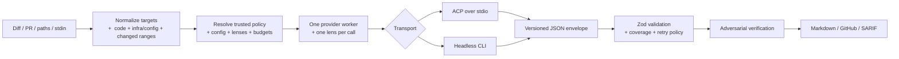

# ADR-0001: Bounded provider-neutral CLI agents

## Status

Accepted

## Context

AgentsKit Code Review must work with multiple model providers and local coding
CLIs without breaking the existing `AdapterFactory` contract or making a review
unreliable. The current product already owns the review orchestration: lenses,
adversarial verification, consolidation, thresholds, and reporters. Local CLI
adapters currently exist for Codex and Claude Code, while API providers resolve
through `@agentskit/adapters`.

The next integrations are Grok Build and OpenCode as local CLIs. Both expose
headless operation and an Agent Client Protocol (ACP) stdio mode, but they are
full coding agents with their own configuration, tools, plugins, MCP servers,
memory, permissions, and model routing. Treating them as unrestricted agents
would make coverage, cost, security, and reproducibility impossible to prove.

The design must also handle:

- untrusted pull requests and fork workflows;
- provider and CLI version drift;
- strict structured output;
- local privacy and remote data boundaries;
- bounded CPU, memory, latency, and provider calls;
- idempotent GitHub reporting;
- future extensions without loading executable code from a repository under review.

## Decision

Keep the existing AgentsKit `AdapterFactory` boundary and add a provider
registry around it. API providers and local CLI agents remain separate kinds of
provider, even when they use the same underlying model vendor.



### Provider identity and support levels

Existing API identifiers retain their meaning:

```text
grok          = xAI API adapter
grok-cli      = local Grok Build CLI
opencode-cli  = local OpenCode CLI
```

Providers are classified as:

- `stable`: registry metadata, offline contract tests, fixtures, and doctor
  support;
- `experimental`: dynamically resolvable or partially tested, without a stable
  support promise;
- `unsupported`: unknown or incompatible providers.

API provider discovery remains compatible with factories exported by
`@agentskit/adapters`. Local CLI executables are never discovered arbitrarily;
they must be explicitly registered.

### CLI transport

Grok Build and OpenCode support ACP over stdio and headless execution. ACP is
the default transport. Headless is explicit, and `auto` is available only for
local runs. CI does not silently fall back from ACP to headless.

The adapter owns process lifecycle, timeout, cancellation, environment
sanitization, transport parsing, and conversion to the existing
`AdapterFactory` stream shape. The review engine remains the sole orchestrator.

Each provider invocation is a worker for exactly one lens. CLI agents must not
create additional lenses, subagents, verification passes, or reporters.

### Trust and context modes

`isolated` is the default and is mandatory for CI:

- temporary `HOME` and configuration;
- environment allowlist;
- explicit provider credentials only;
- no shell, MCP, plugins, subagents, or write capabilities;
- no access to the real checkout;
- prompt-only context by default.

`trusted-local` is an explicit local-only mode. It may inherit the user's CLI
configuration, login, model, endpoint, skills, and preferences, but the review
worker still cannot use tools or alter the review orchestration. It is never
enabled by a project config file or CI workflow from an untrusted PR.

`isolated-snapshot` is an opt-in context mode. It copies only files selected by
explicit allowlisted paths or glob patterns. Patterns are relative to the
repository root, use `/`, reject absolute paths and `..`, and cannot traverse
symlinks outside the root. `.git`, `.env*`, credentials, keys, certificates,
`node_modules`, build output, binaries, and equivalent sensitive content remain
blocked. Defaults are 100 files/5 MB with absolute ceilings of 500 files/25 MB.

Input limits also apply to prompt-only reviews: 256 KB per file and 5 MB per
execution by default, with absolute ceilings of 1 MB and 25 MB. Oversized files
are marked `UNREVIEWED`; they are never silently truncated.

### Configuration and trust boundary

The project may contain one strict JSON file:

```text
.agentskit-review.json
```

It has `configVersion: 1` and contains review policy such as enabled/required
lenses, thresholds, votes, conventions, file budgets, and concurrency. Flags
override file values, and secrets never belong in the file.

Provider, model, transport, context, trust mode, redaction, and permissions are
trusted execution inputs. In CI they come from the workflow or an explicitly
trusted configuration, not from the PR's version of the project file.

Configuration precedence is:

```text
trusted flags/workflow > trusted config > local/project config > defaults
```

Project conventions (`AGENTS.md`, `CLAUDE.md`, `.cursorrules`, and similar
files) are untrusted data when they come from the reviewed tree. They cannot
override the review contract, security policy, required lenses, or output
schema.

### Structured output contract

Every CLI transport must produce a versioned JSON envelope:

```json
{
  "schemaVersion": 1,
  "findings": []
}
```

The envelope is validated before it becomes an AgentsKit tool call. Markdown,
free-form text, unknown schema versions, and partial JSON are not accepted as a
successful lens result. One bounded retry is allowed only for invalid or empty
structured output. Timeouts, authentication failures, permission violations,
and process failures are not retried by this policy.

The public `AdapterFactory` contract remains unchanged. Machine-readable review
output, exit codes, provider IDs, flags, config schema, and Finding schema are
versioned public contracts. Markdown presentation may evolve.

### Coverage and failure policy

Each lens has independent `enabled` and `required` settings. By default,
correctness, security, and tests are required; other built-in lenses are
optional. A required lens can be disabled only through an explicit policy, and
that policy produces an incomplete review.

```text
exit 0 = complete review with no blocking finding
exit 1 = complete review with a blocking finding
exit 2 = incomplete review or execution/configuration failure
```

`--no-fail` affects findings only; it never hides execution or required-lens
coverage failures. `--allow-incomplete` is an explicit local exception.

### Budgets, versions, and diagnosis

Local CLI concurrency defaults to 1. API provider concurrency may use a higher
default. A preflight plan calculates files, bytes, enabled lenses, votes,
retries, concurrency, and estimated provider calls before execution. `maxCalls`
is configurable but always has an absolute ceiling; unlimited mode does not
exist.

`doctor` is offline by default and checks executable, version, transport,
configuration mode, and credential presence without sending a model request.
`doctor --live` is the explicit smoke test. In local runs, unknown CLI versions
warn; CI rejects unknown or incompatible versions. CLIs are not installed
automatically by the Action.

Provider, CLI version, model, transport, policy, context, redaction policy, and
conventions hash form the review fingerprint. The fingerprint is stored with
the reviewed head SHA for incremental GitHub reviews.

### Data and diagnostics security

The effective data boundary is `local`, `remote`, or `unknown`. `remote` and
`unknown` require high-confidence secret redaction. Unredacted remote review is
not allowed in CI. The original values never enter logs, diagnostics, reports,
or provider errors.

In `isolated` mode, child processes receive only an environment allowlist.
Provider stdout/stderr is bounded and sanitized before it can reach an error or
log. GitHub tokens, cloud credentials, package tokens, and unrelated secrets
are not inherited.

### GitHub behavior

The Action uses the safe pull-request workflow boundary and never requires
`pull_request_target` to expose secrets to untrusted code. Fork PRs without
credentials are reported as `SKIPPED/INCOMPLETE`; they are never represented as
an approval.

The GitHub summary is identified by a stable marker. Its body is updated rather
than duplicated. Incremental runs store the previous head SHA and review
fingerprint in that marker. A missing baseline, force-push, or fingerprint
change triggers a full review. Inline findings use stable fingerprints and
human comments are never modified.

All GitHub requests have deadlines. Reads may retry with bounded backoff;
comment writes are reconciled by marker before any retry to avoid duplicates.

### Extensibility

Declarative rules/conventions are the customization mechanism for the initial
release. Executable plugins are deliberately deferred. The existing `Lens`,
`Reporter`, and `AdapterFactory` seams remain the future extension points.

When plugins are eventually added, they must be explicitly selected, versioned,
capability-declared, and authorized by a trusted workflow or user. They are
never auto-discovered from the repository under review.

## Consequences

### Positive

- Existing provider and `AdapterFactory` contracts remain compatible.
- Grok Build and OpenCode can share a bounded CLI architecture.
- CI cannot silently inherit project or user capabilities.
- Partial, oversized, or malformed reviews cannot appear as approvals.
- Local execution remains convenient through explicit trusted mode.
- Provider growth is visible through registry support levels and `doctor`.
- GitHub comments become incremental and idempotent without a database.
- Cost, memory, process count, and input size are bounded before execution.

### Negative

- Isolated local mode cannot reuse interactive CLI login unless credentials are
  supplied explicitly.
- Supporting ACP and headless doubles transport fixtures and parsers.
- Redaction may reduce the detail available to a security lens.
- Fork reviews may be skipped until a trusted GitHub App/runner exists.
- The registry, compatibility fixtures, and version checks require maintenance.
- A full cross-file review requires explicit patterns and consumes more budget.

### Neutral

- Trusted-local is intentionally a separate security posture, not a hidden
  fallback.
- Provider cost cannot always be reported when a CLI does not expose usage or
  pricing metadata.
- Plugin support remains possible but is not part of the first implementation.

## Alternatives Considered

### Arbitrary `--command` integration

Rejected. It creates shell/quoting, parser, version, and security ambiguity.
Named CLI registry entries are explicit and testable.

### Treat every CLI as an autonomous reviewer

Rejected. It duplicates the existing lens/verifier orchestration and makes
coverage, cost, and failure semantics unverifiable.

### Headless-only transport

Rejected. ACP provides a shared stdio protocol for supported coding agents;
headless remains an explicit compatibility path.

### Full repository snapshots by default

Rejected. They increase data exposure, cost, and secret leakage risk. Context
expansion must be allowlisted.

### Automatic CLI installation in GitHub Actions

Rejected. Runtime installation introduces supply-chain and version-drift risk.
Installation can be added later as a separately pinned, checksum-verified
capability.

### Unlimited or silently truncated reviews

Rejected. Both hide incomplete coverage or create unbounded cost. The system
fails before execution or reports `UNREVIEWED` explicitly.

### Executable plugins loaded from the project

Rejected. A reviewed PR must not gain code execution through reviewer
configuration.

## References

- [Grok Build headless and ACP documentation](https://docs.x.ai/build/cli/headless-scripting)
- [OpenCode CLI documentation](https://opencode.ai/docs/cli/)
- [OpenCode ACP documentation](https://opencode.ai/docs/acp/)
- [GitHub Actions compromised runner guidance](https://docs.github.com/en/actions/concepts/security/compromised-runners)
- [Provider selection](/src/cli.ts)
- [Review orchestration](/agents/code-review/agent.ts)
- [GitHub reporters](/agents/code-review/reporters.ts)
